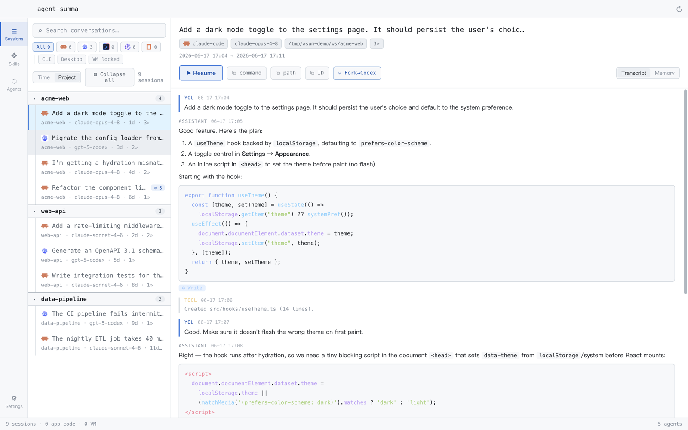
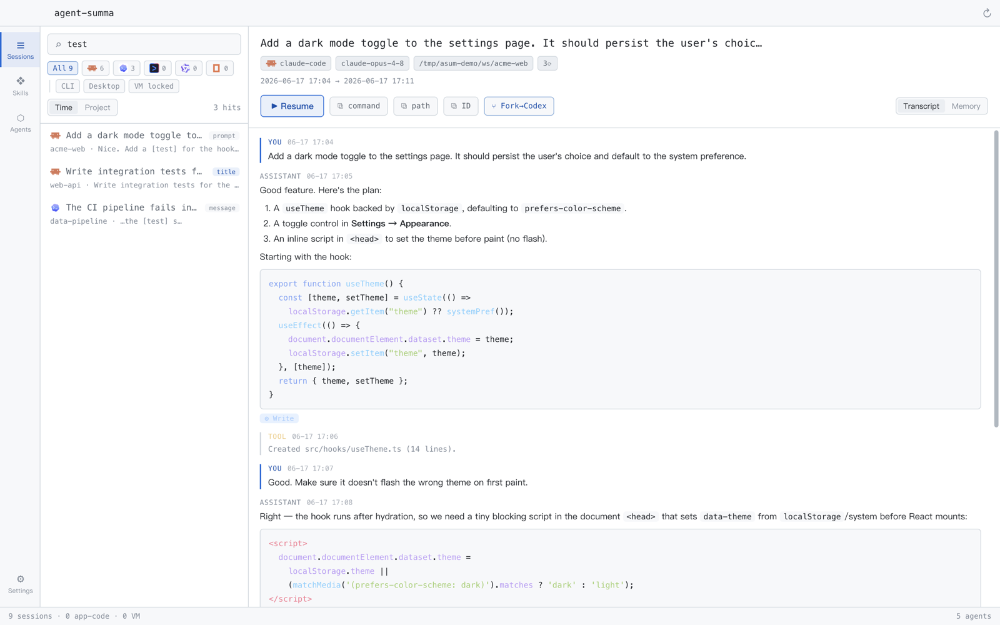
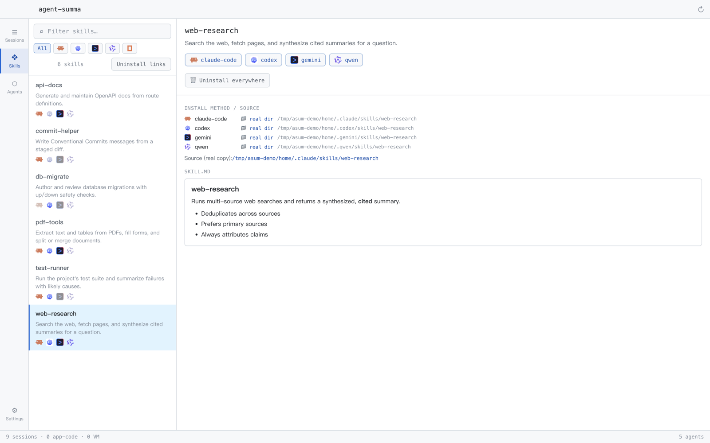
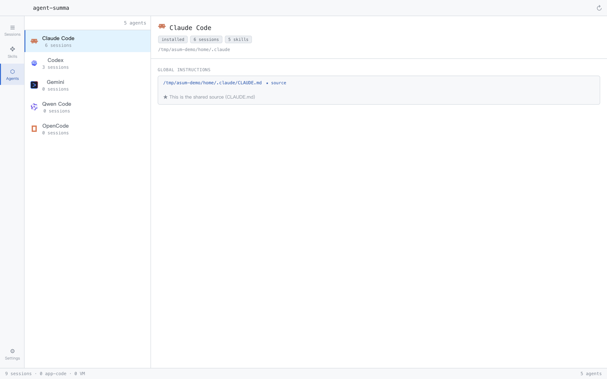
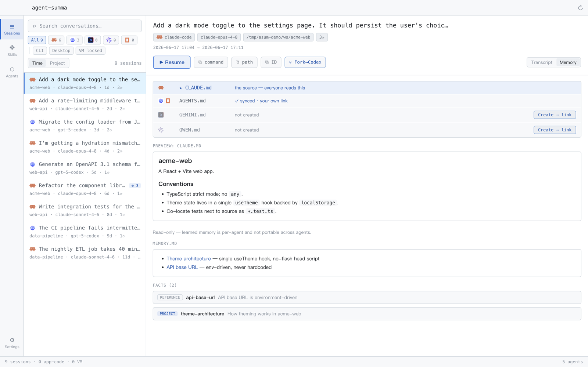

# agent-summa

> A **local-first desktop app** that unifies the **sessions, skills, and memory** of all your AI coding agents into one searchable place.

If you run more than one CLI coding agent — **Claude Code, Codex, Gemini CLI, Qwen, OpenCode, oh-my-pi, Cursor** — your history is scattered across each tool, with no way to search, resume, or compare across them. agent-summa reads each agent's local session files, indexes them into one library, and lets you **search, resume, and fork across agents** — plus manage the skills and instruction files they share.

Everything runs on your machine: **no accounts, no servers, no network calls.** It reads your own local files and never sends anything out.



---

## Features

- **Sessions** — one unified, full-text-searchable library of every agent's past sessions. Transcript viewer (with sub-agent / workflow drill-down), **one-click resume** (relaunches the agent's own `--resume` in the right cwd), **cross-agent fork** (reopen a Claude session in Codex, or vice-versa, with context carried over), and group-by-project with collapsible groups.
- **Search** — FTS5 **trigram** full-text search (substring + CJK aware) over message content **and** session metadata (title / project / first prompt). Indexing runs off the main thread in a worker, so the UI never blocks.
- **Skills** — a skill × agent install matrix. Distribute one skill to every agent that's missing it (symlink + a manifest for clean removal), install/remove per agent, or fully uninstall.
- **Agents** — a per-agent config view: install status, version, home dir, session & skill counts, and that agent's **global instruction file**.
- **Memory** — converge each project's cross-agent instruction files (`CLAUDE.md` / `AGENTS.md` / `GEMINI.md` / `QWEN.md` …) onto one source of truth via symlink — *write once, every agent reads it* — and browse each agent's learned-fact store (read-only).

## Screenshots

**Cross-agent full-text search** — one query across every agent's history, tagged by where it matched (prompt / title / content).



**Skills × agent matrix** — see which agents have each skill, then distribute / install / remove with one click.



**Per-agent config** — install status, session & skill counts, and each agent's global instruction file.



**Project memory** — converge each project's cross-agent instruction files onto one source, and browse the learned-fact store.



> **Six built-in themes**, light and dark — GitHub Light (default), Solarized Light, Catppuccin Latte, Terminal, Graphite, Spotlight. Switch in Settings. Theming is a CSS-variable contract, so adding a theme is a single set of tokens.

## Principles

- **Local-first** — reads only the local machine and your own files; zero accounts, servers, or outbound transfer.
- **Read-first, reversible writes** — by default it only indexes and displays. Write operations (fork, skill/instruction distribution) only touch artifacts recorded in agent-summa's own manifest, and back up anything they replace; your original files are left alone.
- **The index is a disposable cache** — the agents' JSONL files are the source of truth; a corrupt index can be deleted and rebuilt.
- **Honest about lossy operations** — cross-agent fork is "reopen with context," not a byte-faithful copy, and the UI says so.

## Supported agents

| Agent | Read | Resume | Fork |
|---|---|---|---|
| Claude Code (incl. Claude Desktop's CC sessions) | ✅ | ✅ | ✅ |
| Codex | ✅ | ✅ | ✅ |
| oh-my-pi (`omp`; incl. legacy `~/.pi` sessions) | ✅ | ✅ | ✅ |
| Gemini CLI | ✅ | ✅ | ✅ |
| Qwen | ✅ | ✅ | — |
| OpenCode | ✅ | ✅ | — |
| Cursor | partial | — | — |

## Tech stack

Electron 41 · electron-vite · Vite 7 · React 18 · TypeScript · `better-sqlite3` (FTS5). A pnpm monorepo: **`core/`** is framework-agnostic pure TypeScript (no Electron import — provider adapters, the SQLite index, scanner, fork, skills, memory), and **`app/`** is the Electron shell (main / preload / renderer). See [`docs/STACK.md`](docs/STACK.md) for the exact, code-verified stack.

## Develop

Requires Node ≥ 20 and pnpm ≥ 10.

```bash
pnpm install
pnpm --filter @agent-summa/app rebuild:native   # rebuild better-sqlite3 for the Electron ABI
pnpm --filter @agent-summa/app dev               # launch the app (HMR)
```

Other scripts:

```bash
pnpm typecheck   # tsc --noEmit across packages
pnpm lint        # oxlint
pnpm test        # vitest (core)
pnpm --filter @agent-summa/app build   # production build into app/out
```

> Note: `better-sqlite3` is a native module. The app runs on the **Electron ABI**; the `core` CLI (`pnpm --filter @agent-summa/core scan`) runs on the **node ABI** — switching between them needs a rebuild (`rebuild:native` for Electron, `node-gyp rebuild` for node).

## Status

Active development. Runs via `pnpm dev`, and packages into a distributable via electron-builder — `pnpm --filter @agent-summa/app dist` produces a `.dmg` (macOS), NSIS installer (Windows), or AppImage (Linux); see the `build` block in [`app/package.json`](app/package.json).

## Documentation

- [`docs/PRD.md`](docs/PRD.md) — product requirements, scope, milestones.
- [`docs/CORE-DESIGN.md`](docs/CORE-DESIGN.md) — `core` design: the CanonicalSession / Provider contract, SQLite schema, per-agent mapping.
- [`docs/STACK.md`](docs/STACK.md) — actual dependency versions, constraints, gotchas.
- [`docs/UI.md`](docs/UI.md) — layout, theming, native-feel constraints.

## License

[MIT](LICENSE).
